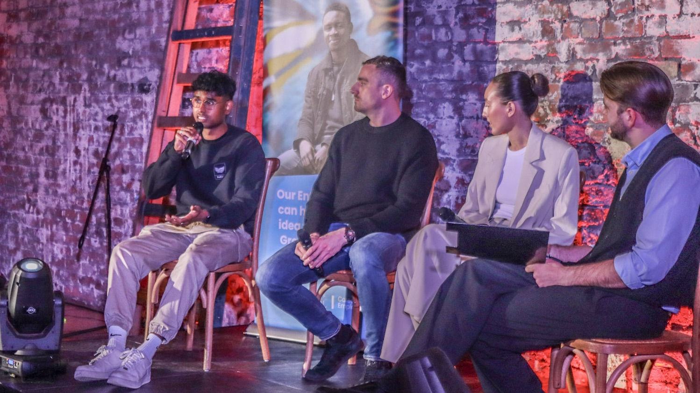

# Hi I'm Marc

I'm a postgraduate Computer Science student at the University of Liverpool from Trinidad and Tobago 🇹🇹
I also work as a Software Engineer, currently based in the UK.

Check out my [projects](/projects) to see what I've been working on.

When I'm not making computers say Hello World, I [write](/writings) and make short [films](/films).

  

    
    
    <a href="{{ latest_project.url }}" class="activity-card">
      

        terminal
      

      
Latest Project

      
{{ latest_project.title }}

      
{{ latest_project.date | date: "%B %Y" }}{{ latest_project.released }}

    </a>
    
    

      

        terminal
      

      
Latest Project

      
No projects yet

      
Stay tuned

    

    

    
    
    <a href="{{ latest_post.url }}" class="activity-card">
      

        draw
      

      
Latest Writing

      
{{ latest_post.title }}

      
{{ latest_post.date | date: "%B %Y" }}

    </a>
    
    

      

        draw
      

      
Latest Writing

      
No writings yet

      
Stay tuned

    

    

    <a href="#" target="_blank" class="activity-card" id="latest-film-card">
      

        

          movie
        

        
Latest Film

        
Loading...

        

      

    </a>
  



<figure>
  
  <figcaption>My parents & I at my graduation, shot on film</figcaption>
</figure>

## Some achievements of mine

  

    workSEP 2024
    
Began working as a Software Engineer with the folks at <a href="https://ultamation.com">Ultamation</a> in the Liverpool Science Park whilst doing my Masters

  

  

    schoolSEP 2024
    
Started my MSc in Advanced Computer Science

  

  

    verifiedJUN 2024
    
Graduated from the University of Liverpool with a BSc in Computer Science

  

  

    workJUN 2023
    
Interned as a Software Engineer for the summer at <a href="https://octopus.energy">Octopus Energy</a> in Manchester

  

  

    trophyMAY 2023
    
<a href="/wildroutes">Wildroutes</a> won first place at the Design Your Future Startup Pitching Competition

  

  

    groupsSEP 2022
    
Began working as a Careers Coach at the University of Liverpool, whilst studying for my Bachelors

  

  

    ecoJUN 2022
    
Spent the summer interning at <a href="https://voicefornature.com">Voice for Nature</a>

  

  

    celebrationSEP 2021
    
<a href="/goodbyeforever">Goodbye Forever</a> became a tiny local hit

  

  

    movieSEP 2021
    
<a href="/wrecked">Wrecked</a> is officially selected for the T&T Film Festival

  

  

    military_techJUN 2020
    
Awarded a <a href="https://napcol.bluechiptt.com/scholarships-2020/">national scholarship</a> from the Government of Trinidad & Tobago for excellence in Computer Science

  

  

    starsMAY 2020
    
Earned the Duke of Edinburgh Gold Award and met the President of Trinidad and Tobago

  

  

    scuba_divingDEC 2019
    
Became a certified PADI Rescue Diver

  

Here's to some more.

<figure>
  
  <figcaption>Me speaking on stage at Design Your Future 2024</figcaption>
</figure>